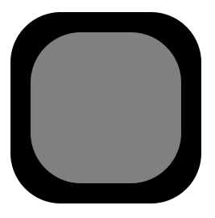

# Smart rounding
Smart rounding for nested rounded with CSS HTML elements.
Works with any value of border radius, including asymmetrical rounding.
## Comparison
using same border-radius for both parent and child:



using `smart-rounding.mjs`:


## Usage
```js
import { selectorPairs, useRoundingOnAll } from "./smart-rounding.mjs";

/*
Default pairs are {"smart-rounding-target": "smart-rounding-source"}.
Pairs are present in the form of an object with keys as the target selector
    (element to which rounding is applied) and values as the source selector 
    (element from which target rounding is calculated).
Clear the pairs with selectorPairs.clear()
Add new pairs by setting object properties
*/
selectorPairs.clear();
// Create new pairs
selectorPairs['#outer'] = '.inner'

/*
Use all the pairs with useRoundingOnAll
There are also useRounnding function that takes target and source directly 
    instead of selectors, and useRoungdingFromChild function that takes
    target element and source selector, both of which are used by
    useRoundingOnAll.
*/
document.addEventListener("DOMContentLoaded", useRoundingOnAll);
```
## Notes
- This program is not finished yet, there may be bugs we don't yet know about.
- If you plan to use this code, do not use it in production. A better solution is to use it only while developing, then copying generated border-radius values to your CSS.
- Remember to use `smart-rounding.mjs` instead of `smart-rounding.js` and to add `type="module"` to your script tag(s).